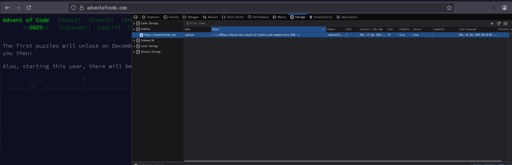

# steal-gift: _steal_ your AoC's inputs from Santa!

## Quickstart
To quickly get started with a day, you can copy-paste this template:

- `today.ua`
```uiua
~ "git: github.com/amatgil/steal-gift" ~ AoCGet

# ====== INPUTS ======
Input ← AoCGet YEAR DAY

# ====== PART 1 ======
Part₁ ← ∘

# ====== TESTS =======
⍤⤙≍ "testsol1" Part₁ "testcase1"

# ======== RUNNING ========
#$"Part one solution is: '_'" Part₁ Input
```
- `.env`
```sh
session="XXXXXXXXXXXXXXXXXXXXXXXXXXXXXXXXXXXXXXXXXXXXXXXXXXXXXXXXXXXXXXXXXXXXXXXXXXXXXXXXXXXXXXXXXXXXXXXXXXXXXXXXXXXXXXXXXXXXXXXXXXXXXXXX"
cachedInputsPath="/tmp/aoc-inputs"
debug="any text here works!"
contact="your_email@here.com"
```

## Usage
**IMPORTANT**: You must place your session cookie and path inside a `.env` file, like such:
```sh
# In .env
session="XXXXXXXXXXXXXXXXXXXXXXXXXXXXXXXXXXXXXXXXXXXXXXXXXXXXXXXXXXXXXXXXXXXXXXXXXXXXXXXXXXXXXXXXXXXXXXXXXXXXXXXXXXXXXXXXXXXXXXXXXXXXXXXX"
cachedInputsPath="/tmp/aoc-inputs"
debug="hello hai :3"
contact="your_email@here.com"
```

- `session`: Your Advent of Code (since the input changes per person). To get it, log into your account at adventofcode.com and use the DevTools to find it (example at the end of this README).
- `cachedInputsPath`: Where all inputs will be saved. For example, if you choose `/tmp/aoc-inputs`, it'll slowly get populated by `/tmp/aoc-inputs/2024-01.txt`, `/tmp/aoc-inputs/2024-02.txt`, ...
- `debug`: If this variable exists at all, it is taken as "true"; "false" otherwise. If true, it includes prints telling you the source of the input (server or locally).
- `contact`: Some method to contact you, the user of the library. Eric has requested this, to be able to contact a user in case something goes wrong.

Then, in your code, you may run:
```sh
Input ← AoCGet 2023 2
```
Which will download day 2, from the year 2023, to `$cachedInputPath/2023-02.txt`.

If you've already got a file with that name, it will be read directly. If not, it will be fetched
and saved under that name, so subsequent calls shall read from it.


# Getting your session cookie
## On firefox

